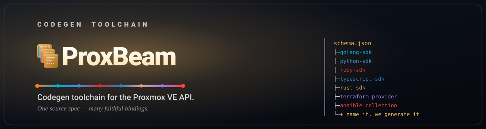

  

<h3 align="center">One source spec, many faithful bindings.</h3>

  
  
  

Built with ❤️ for the Proxmox community.

  &nbsp;&nbsp;

> [!NOTE]
> The repositories are being prepared for their public release.

## About

[Proxmox VE](https://www.proxmox.com/en/proxmox-ve) does not publish a
machine-readable OpenAPI specification for its REST API. ProxBeam
extracts the schema from the signed, versioned PVE packages, validates it into
a stable JSON specification, and generates client libraries and infrastructure
tooling from it. All targets are regenerated together, with one release per
pinned PVE schema version.

## Projects

| Category | Project | Description | Source |
|---|---|---|---|
| Toolchain | [`proxbeam`](https://github.com/proxbeam/proxbeam) | Schema extraction and code generators | Crafted |
| SDKs | [`golang-sdk`](https://github.com/proxbeam/golang-sdk) | Go client | Codegen |
| | [`python-sdk`](https://github.com/proxbeam/python-sdk) | Python client with type hints | Codegen |
| | [`typescript-sdk`](https://github.com/proxbeam/typescript-sdk) | TypeScript client | Codegen |
| | [`rust-sdk`](https://github.com/proxbeam/rust-sdk) | Rust client | Codegen |
| | [`ruby-sdk`](https://github.com/proxbeam/ruby-sdk) | Ruby client with RBS types | Codegen |
| Infrastructure | [`terraform-provider-proxmox`](https://github.com/proxbeam/terraform-provider-proxmox) | Terraform provider | Codegen |
| | [`ansible-collection`](https://github.com/proxbeam/ansible-collection) | Ansible collection | Codegen |
| Kubernetes | [`terraform-proxmox-kubernetes`](https://github.com/proxbeam/terraform-proxmox-kubernetes) | OpenTofu module that builds [Talos](https://www.talos.dev/) Kubernetes clusters on Proxmox VE, with Karpenter node autoscaling | Crafted |
| | [`karpenter-provider-proxmox`](https://github.com/proxbeam/karpenter-provider-proxmox) | [Karpenter](https://karpenter.sh/) provider: Kubernetes node autoscaling on Proxmox VE for any distribution (Talos, k3s, kubeadm, RKE2) | Crafted |
| | [`proxmox-cloud-controller-manager`](https://github.com/proxbeam/proxmox-cloud-controller-manager) | [Cloud controller manager](https://kubernetes.io/docs/concepts/architecture/cloud-controller/): ties each Kubernetes Node to its Proxmox VE VM, with zones, addresses and instance types | Crafted |
| | [`proxmox-csi-plugin`](https://github.com/proxbeam/proxmox-csi-plugin) | [CSI](https://github.com/container-storage-interface/spec) plugin: Kubernetes persistent volumes as Proxmox VE disks | Crafted |
| CI | [`fleeting-plugin-proxmox`](https://github.com/proxbeam/fleeting-plugin-proxmox) | [GitLab Runner fleeting](https://docs.gitlab.com/runner/fleet_scaling/fleeting/) plugin for autoscaling CI job VMs | Crafted |

Codegen projects are produced by `proxbeam` from the PVE schema; each SDK
covers all 680 endpoints. Crafted projects are designed and written directly,
and released on their own schedule.

## Support

  Built with ❤️ for the Proxmox community. 
  If these tools make your day a little easier, you can say thanks here:

  &nbsp;&nbsp;

